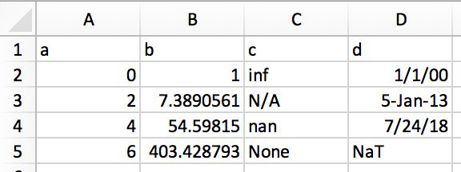

# Python Pandas: Tricks & Features You May Not Know


Pandas is a foundational library for analytics, data processing, and data science. It’s a huge project with tons of optionality and depth.

This tutorial will cover some lesser-used but idiomatic Pandas capabilities that lend your code better readability, versatility, and speed, *à la* the Buzzfeed listicle.

If you feel comfortable with the core concepts of Python’s Pandas library, hopefully you’ll find a trick or two in this article that you haven’t stumbled across previously. (If you’re just starting out with the library, [10 Minutes to Pandas](https://pandas.pydata.org/pandas-docs/stable/10min.html) is a good place to start.)

**Note**: The examples in this article are tested with Pandas version 0.23.2 and Python 3.6.6. However, they should also be valid in older versions.

## 1. Configure Options & Settings at Interpreter Startup

You may have run across Pandas’ rich [options and settings](https://pandas.pydata.org/pandas-docs/stable/options.html) system before.

It’s a huge productivity saver to set customized Pandas options at interpreter startup, especially if you work in a scripting environment. You can use `pd.set_option()` to configure to your heart’s content with a [Python](https://docs.python.org/tutorial/appendix.html#the-interactive-startup-file) or [IPython](https://ipython.readthedocs.io/en/stable/interactive/tutorial.html#startup-files) startup file.

The options use a dot notation such as `pd.set_option('display.max_colwidth', 25)`, which lends itself well to a nested dictionary of options:

```python
import pandas as pd

def start():
    options = {
        'display': {
            'max_columns': None,
            'max_colwidth': 25,
            'expand_frame_repr': False,  # Don't wrap to multiple pages
            'max_rows': 14,
            'max_seq_items': 50,         # Max length of printed sequence
            'precision': 4,
            'show_dimensions': False
        },
        'mode': {
            'chained_assignment': None   # Controls SettingWithCopyWarning
        }
    }

    for category, option in options.items():
        for op, value in option.items():
            pd.set_option(f'{category}.{op}', value)  # Python 3.6+

if __name__ == '__main__':
    start()
    del start  # Clean up namespace in the interpreter
```

If you launch an interpreter session, you’ll see that everything in the startup script has been executed, and Pandas is imported for you automatically with your suite of options:

```python
>>> pd.__name__
'pandas'
>>> pd.get_option('display.max_rows')
14
```

Let’s use some data on [abalone](https://en.wikipedia.org/wiki/Abalone) hosted by the UCI Machine Learning Repository to demonstrate the formatting that was set in the startup file. The data will truncate at 14 rows with 4 digits of precision for floats:

```python
>>> url = ('https://archive.ics.uci.edu/ml/'
...        'machine-learning-databases/abalone/abalone.data')
>>> cols = ['sex', 'length', 'diam', 'height', 'weight', 'rings']
>>> abalone = pd.read_csv(url, usecols=[0, 1, 2, 3, 4, 8], names=cols)

>>> abalone
     sex  length   diam  height  weight  rings
0      M   0.455  0.365   0.095  0.5140     15
1      M   0.350  0.265   0.090  0.2255      7
2      F   0.530  0.420   0.135  0.6770      9
3      M   0.440  0.365   0.125  0.5160     10
4      I   0.330  0.255   0.080  0.2050      7
5      I   0.425  0.300   0.095  0.3515      8
6      F   0.530  0.415   0.150  0.7775     20
...   ..     ...    ...     ...     ...    ...
4170   M   0.550  0.430   0.130  0.8395     10
4171   M   0.560  0.430   0.155  0.8675      8
4172   F   0.565  0.450   0.165  0.8870     11
4173   M   0.590  0.440   0.135  0.9660     10
4174   M   0.600  0.475   0.205  1.1760      9
4175   F   0.625  0.485   0.150  1.0945     10
4176   M   0.710  0.555   0.195  1.9485     12
```

You’ll see this dataset pop up in other examples later as well.

## 2. Make Toy Data Structures With Pandas’ Testing Module

Hidden way down in Pandas’ [`testing`](https://github.com/pandas-dev/pandas/blob/master/pandas/util/testing.py) module are a number of convenient functions for quickly building quasi-realistic Series and DataFrames:

```python
>>> import pandas.util.testing as tm
>>> tm.N, tm.K = 15, 3  # Module-level default rows/columns

>>> import numpy as np
>>> np.random.seed(444)

>>> tm.makeTimeDataFrame(freq='M').head()
                 A       B       C
2000-01-31  0.3574 -0.8804  0.2669
2000-02-29  0.3775  0.1526 -0.4803
2000-03-31  1.3823  0.2503  0.3008
2000-04-30  1.1755  0.0785 -0.1791
2000-05-31 -0.9393 -0.9039  1.1837

>>> tm.makeDataFrame().head()
                 A       B       C
nTLGGTiRHF -0.6228  0.6459  0.1251
WPBRn9jtsR -0.3187 -0.8091  1.1501
7B3wWfvuDA -1.9872 -1.0795  0.2987
yJ0BTjehH1  0.8802  0.7403 -1.2154
0luaYUYvy1 -0.9320  1.2912 -0.2907
```

There are around 30 of these, and you can see the full list by calling `dir()` on the module object. Here are a few:

```python
>>> [i for i in dir(tm) if i.startswith('make')]
['makeBoolIndex',
 'makeCategoricalIndex',
 'makeCustomDataframe',
 'makeCustomIndex',
 # ...,
 'makeTimeSeries',
 'makeTimedeltaIndex',
 'makeUIntIndex',
 'makeUnicodeIndex']
```

These can be useful for benchmarking, testing assertions, and experimenting with Pandas methods that you are less familiar with.

## 3. Take Advantage of Accessor Methods

Perhaps you’ve heard of the term **accessor**, which is somewhat like a getter (although getters and setters are used infrequently in Python). For our purposes here, you can think of a Pandas accessor as a property that serves as an interface to additional methods.

Pandas Series have three of them:

```python
>>> pd.Series._accessors
{'cat', 'str', 'dt'}
```

Yes, that definition above is a mouthful, so let’s take a look at a few examples before discussing the internals.

`.cat` is for categorical data, `.str` is for string (object) data, and `.dt` is for datetime-like data. Let’s start off with `.str`: imagine that you have some raw city/state/ZIP data as a single field within a Pandas Series.

Pandas string methods are [vectorized](https://realpython.com/numpy-array-programming/#what-is-vectorization), meaning that they operate on the entire array without an explicit for-loop:

```python
>>> addr = pd.Series([
...     'Washington, D.C. 20003',
...     'Brooklyn, NY 11211-1755',
...     'Omaha, NE 68154',
...     'Pittsburgh, PA 15211'
... ])

>>> addr.str.upper()
0     WASHINGTON, D.C. 20003
1    BROOKLYN, NY 11211-1755
2            OMAHA, NE 68154
3       PITTSBURGH, PA 15211
dtype: object

>>> addr.str.count(r'\d')  # 5 or 9-digit zip?
0    5
1    9
2    5
3    5
dtype: int64
```

For a more involved example, let’s say that you want to separate out the three city/state/ZIP components neatly into DataFrame fields.

You can pass a [regular expression](https://docs.python.org/howto/regex.html) to `.str.extract()` to “extract” parts of each cell in the Series. In `.str.extract()`, `.str` is the accessor, and `.str.extract()` is an accessor method:

```python
>>> regex = (r'(?P<city>[A-Za-z ]+), '      # One or more letters
...          r'(?P<state>[A-Z]{2}) '        # 2 capital letters
...          r'(?P<zip>\d{5}(?:-\d{4})?)')  # Optional 4-digit extension
...
>>> addr.str.replace('.', '').str.extract(regex)
         city state         zip
0  Washington    DC       20003
1    Brooklyn    NY  11211-1755
2       Omaha    NE       68154
3  Pittsburgh    PA       15211
```

This also illustrates what is known as method-chaining, where `.str.extract(regex)` is called on the result of `addr.str.replace('.', '')`, which cleans up use of periods to get a nice 2-character state abbreviation.

It’s helpful to know a tiny bit about how these accessor methods work as a motivating reason for why you should use them in the first place, rather than something like `addr.apply(re.findall, ...)`.

Each accessor is itself a bona fide Python class:

- `.str` maps to [`StringMethods`](https://github.com/pandas-dev/pandas/blob/3e4839301fc2927646889b194c9eb41c62b76bda/pandas/core/strings.py#L1766).
- `.dt` maps to [`CombinedDatetimelikeProperties`](https://github.com/pandas-dev/pandas/blob/3e4839301fc2927646889b194c9eb41c62b76bda/pandas/core/indexes/accessors.py#L306).
- `.cat` routes to [`CategoricalAccessor`](https://github.com/pandas-dev/pandas/blob/3e4839301fc2927646889b194c9eb41c62b76bda/pandas/core/arrays/categorical.py#L2356).

These standalone classes are then “attached” to the Series class using a [`CachedAccessor`](https://github.com/pandas-dev/pandas/blob/master/pandas/core/accessor.py). It is when the classes are wrapped in `CachedAccessor`that a bit of magic happens.

`CachedAccessor` is inspired by a “cached property” design: a property is only computed once per instance and then replaced by an ordinary attribute. It does this by overloading the [`.__get__()` method](https://docs.python.org/reference/datamodel.html#object.__get__), which is part of Python’s descriptor protocol.

**Note**: If you’d like to read more about the internals of how this works, see the [Python Descriptor HOWTO](https://docs.python.org/howto/descriptor.html) and [this post](https://www.pydanny.com/cached-property.html) on the cached property design. Python 3 also introduced [`functools.lru_cache()`](https://docs.python.org/library/functools.html#functools.lru_cache), which offers similar functionality.

The second accessor, `.dt`, is for datetime-like data. It technically belongs to Pandas’ `DatetimeIndex`, and if called on a Series, it is converted to a `DatetimeIndex` first:

```python
>>> daterng = pd.Series(pd.date_range('2017', periods=9, freq='Q'))
>>> daterng
0   2017-03-31
1   2017-06-30
2   2017-09-30
3   2017-12-31
4   2018-03-31
5   2018-06-30
6   2018-09-30
7   2018-12-31
8   2019-03-31
dtype: datetime64[ns]

>>>  daterng.dt.day_name()
0      Friday
1      Friday
2    Saturday
3      Sunday
4    Saturday
5    Saturday
6      Sunday
7      Monday
8      Sunday
dtype: object

>>> # Second-half of year only
>>> daterng[daterng.dt.quarter > 2]
2   2017-09-30
3   2017-12-31
6   2018-09-30
7   2018-12-31
dtype: datetime64[ns]

>>> daterng[daterng.dt.is_year_end]
3   2017-12-31
7   2018-12-31
dtype: datetime64[ns]
```

The third accessor, `.cat`, is for Categorical data only, which you’ll see shortly in its own section.

## 4. Create a DatetimeIndex From Component Columns

Speaking of datetime-like data, as in `daterng` above, it’s possible to create a Pandas `DatetimeIndex` from multiple component columns that together form a date or datetime:

```python
>>> from itertools import product
>>> datecols = ['year', 'month', 'day']

>>> df = pd.DataFrame(list(product([2017, 2016], [1, 2], [1, 2, 3])),
...                   columns=datecols)
>>> df['data'] = np.random.randn(len(df))
>>> df
    year  month  day    data
0   2017      1    1 -0.0767
1   2017      1    2 -1.2798
2   2017      1    3  0.4032
3   2017      2    1  1.2377
4   2017      2    2 -0.2060
5   2017      2    3  0.6187
6   2016      1    1  2.3786
7   2016      1    2 -0.4730
8   2016      1    3 -2.1505
9   2016      2    1 -0.6340
10  2016      2    2  0.7964
11  2016      2    3  0.0005

>>> df.index = pd.to_datetime(df[datecols])
>>> df.head()
            year  month  day    data
2017-01-01  2017      1    1 -0.0767
2017-01-02  2017      1    2 -1.2798
2017-01-03  2017      1    3  0.4032
2017-02-01  2017      2    1  1.2377
2017-02-02  2017      2    2 -0.2060
```

Finally, you can drop the old individual columns and convert to a Series:

```python
>>> df = df.drop(datecols, axis=1).squeeze()
>>> df.head()
2017-01-01   -0.0767
2017-01-02   -1.2798
2017-01-03    0.4032
2017-02-01    1.2377
2017-02-02   -0.2060
Name: data, dtype: float64

>>> df.index.dtype_str
'datetime64[ns]
```

The intuition behind passing a DataFrame is that a DataFrame resembles a Python dictionary where the column names are keys, and the individual columns (Series) are the dictionary values. That’s why `pd.to_datetime(df[datecols].to_dict(orient='list'))` would also work in this case. This mirrors the construction of Python’s `datetime.datetime`, where you pass keyword arguments such as `datetime.datetime(year=2000, month=1, day=15, hour=10)`.

## 5. Use Categorical Data to Save on Time and Space

One powerful Pandas feature is its `Categorical` dtype.

Even if you’re not always working with gigabytes of data in RAM, you’ve probably run into cases where straightforward operations on a large DataFrame seem to hang up for more than a few seconds.

Pandas `object` dtype is often a great candidate for conversion to category data. (`object` is a container for Python `str`, heterogeneous data types, or “other” types.) Strings occupy a significant amount of space in memory:

```python
>>> colors = pd.Series([
...     'periwinkle',
...     'mint green',
...     'burnt orange',
...     'periwinkle',
...     'burnt orange',
...     'rose',
...     'rose',
...     'mint green',
...     'rose',
...     'navy'
... ])
...
>>> import sys
>>> colors.apply(sys.getsizeof)
0    59
1    59
2    61
3    59
4    61
5    53
6    53
7    59
8    53
9    53
dtype: int64
```

**Note:** I used `sys.getsizeof()` to show the memory occupied by each individual value in the Series. Keep in mind these are Python objects that have some overhead in the first place. (`sys.getsizeof('')` will return 49 bytes.)

There is also `colors.memory_usage()`, which sums up the memory usage and relies on the `.nbytes` attribute of the underlying NumPy array. Don’t get too bogged down in these details: what is important is relative memory usage that results from type conversion, as you’ll see next.

Now, what if we could take the unique colors above and map each to a less space-hogging integer? Here is a naive implementation of that:python

```python
>>> mapper = {v: k for k, v in enumerate(colors.unique())}
>>> mapper
{'periwinkle': 0, 'mint green': 1, 'burnt orange': 2, 'rose': 3, 'navy': 4}

>>> as_int = colors.map(mapper)
>>> as_int
0    0
1    1
2    2
3    0
4    2
5    3
6    3
7    1
8    3
9    4
dtype: int64

>>> as_int.apply(sys.getsizeof)
0    24
1    28
2    28
3    24
4    28
5    28
6    28
7    28
8    28
9    28
dtype: int64
```

**Note**: Another way to do this same thing is with Pandas’ `pd.factorize(colors)`:

```
>>> pd.factorize(colors)[0]
array([0, 1, 2, 0, 2, 3, 3, 1, 3, 4])
```

Either way, you are encoding the object as an enumerated type (categorical variable).

You’ll notice immediately that memory usage is just about cut in half compared to when the full strings are used with `object` dtype.

Earlier in the section on accessors, I mentioned the `.cat` (categorical) accessor. The above with `mapper` is a rough illustration of what is happening internally with Pandas’ `Categorical` dtype:

> “The memory usage of a `Categorical` is proportional to the number of categories plus the length of the data. In contrast, an `object` dtype is a constant times the length of the data.” [(Source)](https://pandas.pydata.org/pandas-docs/stable/categorical.html#memory-usage)

In `colors` above, you have a ratio of 2 values for every unique value (category):

```python
>>> len(colors) / colors.nunique()
2.0
```

As a result, the memory savings from converting to `Categorical` is good, but not great:

```python
>>> # Not a huge space-saver to encode as Categorical
>>> colors.memory_usage(index=False, deep=True)
650
>>> colors.astype('category').memory_usage(index=False, deep=True)
495
```

However, if you blow out the proportion above, with a lot of data and few unique values (think about data on demographics or alphabetic test scores), the reduction in memory required is over 10 times:

```python
>>> manycolors = colors.repeat(10)
>>> len(manycolors) / manycolors.nunique()  # Much greater than 2.0x
20.0

>>> manycolors.memory_usage(index=False, deep=True)
6500
>>> manycolors.astype('category').memory_usage(index=False, deep=True)
585
```

A bonus is that computational efficiency gets a boost too: for categorical `Series`, the string operations [are performed on the `.cat.categories`attribute](https://pandas.pydata.org/pandas-docs/stable/text.html) rather than on each original element of the `Series`.

In other words, the operation is done once per unique category, and the results are mapped back to the values. Categorical data has a `.cat` accessor that is a window into attributes and methods for manipulating the categories:

```python
>>> ccolors = colors.astype('category')
>>> ccolors.cat.categories
Index(['burnt orange', 'mint green', 'navy', 'periwinkle', 'rose'], dtype='object')
```

In fact, you can reproduce something similar to the example above that you did manually:

```python
>>> ccolors.cat.codes
0    3
1    1
2    0
3    3
4    0
5    4
6    4
7    1
8    4
9    2
dtype: int8
```

All that you need to do to exactly mimic the earlier manual output is to reorder the codes:

```python
>>> ccolors.cat.reorder_categories(mapper).cat.codes
0    0
1    1
2    2
3    0
4    2
5    3
6    3
7    1
8    3
9    4
dtype: int8
```

Notice that the dtype is NumPy’s `int8`, an [8-bit signed integer](https://docs.scipy.org/doc/numpy-1.10.0/user/basics.types.html) that can take on values from -127 to 128. (Only a single byte is needed to represent a value in memory. 64-bit signed `ints` would be overkill in terms of memory usage.) Our rough-hewn example resulted in `int64` data by default, whereas Pandas is smart enough to downcast categorical data to the smallest numerical dtype possible.

Most of the attributes for `.cat` are related to viewing and manipulating the underlying categories themselves:

```python
>>> [i for i in dir(ccolors.cat) if not i.startswith('_')]
['add_categories',
 'as_ordered',
 'as_unordered',
 'categories',
 'codes',
 'ordered',
 'remove_categories',
 'remove_unused_categories',
 'rename_categories',
 'reorder_categories',
 'set_categories']
```

There are a few caveats, though. Categorical data is generally less flexible. For instance, if inserting previously unseen values, you need to add this value to a `.categories` container first:

```python
>>> ccolors.iloc[5] = 'a new color'
# ...
ValueError: Cannot setitem on a Categorical with a new category,
set the categories first

>>> ccolors = ccolors.cat.add_categories(['a new color'])
>>> ccolors.iloc[5] = 'a new color'  # No more ValueError
```

If you plan to be setting values or reshaping data rather than deriving new computations, `Categorical` types may be less nimble.

## 6. Introspect Groupby Objects via Iteration

When you call `df.groupby('x')`, the resulting Pandas `groupby` objects can be a bit opaque. This object is lazily instantiated and doesn’t have any meaningful representation on its own.

You can demonstrate with the abalone dataset from example 1:

```python
>>> abalone['ring_quartile'] = pd.qcut(abalone.rings, q=4, labels=range(1, 5))
>>> grouped = abalone.groupby('ring_quartile')

>>> grouped
<pandas.core.groupby.groupby.DataFrameGroupBy object at 0x11c1169b0>
```

Alright, now you have a `groupby` object, but what is this thing, and how do I see it?

Before you call something like `grouped.apply(func)`, you can take advantage of the fact that `groupby` objects are iterable:

```python
>>> help(grouped.__iter__)

        Groupby iterator

        Returns
        -------
        Generator yielding sequence of (name, subsetted object)
        for each group
```

Each “thing” yielded by `grouped.__iter__()` is a tuple of `(name, subsetted object)`, where `name` is the value of the column on which you’re grouping, and `subsetted object` is a DataFrame that is a subset of the original DataFrame based on whatever grouping condition you specify. That is, the data gets chunked by group:

```python
>>> for idx, frame in grouped:
...     print(f'Ring quartile: {idx}')
...     print('-' * 16)
...     print(frame.nlargest(3, 'weight'), end='\n\n')
...
Ring quartile: 1
----------------
     sex  length   diam  height  weight  rings ring_quartile
2619   M   0.690  0.540   0.185  1.7100      8             1
1044   M   0.690  0.525   0.175  1.7005      8             1
1026   M   0.645  0.520   0.175  1.5610      8             1

Ring quartile: 2
----------------
     sex  length  diam  height  weight  rings ring_quartile
2811   M   0.725  0.57   0.190  2.3305      9             2
1426   F   0.745  0.57   0.215  2.2500      9             2
1821   F   0.720  0.55   0.195  2.0730      9             2

Ring quartile: 3
----------------
     sex  length  diam  height  weight  rings ring_quartile
1209   F   0.780  0.63   0.215   2.657     11             3
1051   F   0.735  0.60   0.220   2.555     11             3
3715   M   0.780  0.60   0.210   2.548     11             3

Ring quartile: 4
----------------
     sex  length   diam  height  weight  rings ring_quartile
891    M   0.730  0.595    0.23  2.8255     17             4
1763   M   0.775  0.630    0.25  2.7795     12             4
165    M   0.725  0.570    0.19  2.5500     14             4
```

Relatedly, a `groupby` object also has `.groups` and a group-getter, `.get_group()`:

```python
>>> grouped.groups.keys()
dict_keys([1, 2, 3, 4])

>>> grouped.get_group(2).head()
   sex  length   diam  height  weight  rings ring_quartile
2    F   0.530  0.420   0.135  0.6770      9             2
8    M   0.475  0.370   0.125  0.5095      9             2
19   M   0.450  0.320   0.100  0.3810      9             2
23   F   0.550  0.415   0.135  0.7635      9             2
39   M   0.355  0.290   0.090  0.3275      9             2
```

This can help you be a little more confident that the operation you’re performing is the one you want:

```python
>>> grouped['height', 'weight'].agg(['mean', 'median'])
               height         weight
                 mean median    mean  median
ring_quartile
1              0.1066  0.105  0.4324  0.3685
2              0.1427  0.145  0.8520  0.8440
3              0.1572  0.155  1.0669  1.0645
4              0.1648  0.165  1.1149  1.0655
```

No matter what calculation you perform on `grouped`, be it a single Pandas method or custom-built function, each of these “sub-frames” is passed one-by-one as an argument to that callable. This is where the term “split-apply-combine” comes from: break the data up by groups, perform a per-group calculation, and recombine in some aggregated fashion.

If you’re having trouble visualizing exactly what the groups will actually look like, simply iterating over them and printing a few can be tremendously useful.

## 7. Use This Mapping Trick for Membership Binning

Let’s say that you have a Series and a corresponding “mapping table” where each value belongs to a multi-member group, or to no groups at all:

```python
>>> countries = pd.Series([
...     'United States',
...     'Canada',
...     'Mexico',
...     'Belgium',
...     'United Kingdom',
...     'Thailand'
... ])
...
>>> groups = {
...     'North America': ('United States', 'Canada', 'Mexico', 'Greenland'),
...     'Europe': ('France', 'Germany', 'United Kingdom', 'Belgium')
... }
```

In other words, you need to map `countries` to the following result:

```python
0    North America
1    North America
2    North America
3           Europe
4           Europe
5            other
dtype: object
```

What you need here is a function similar to Pandas’ `pd.cut()`, but for binning based on categorical membership. You can use `pd.Series.map()`, which you already saw in example #5, to mimic this:

```python
from typing import Any

def membership_map(s: pd.Series, groups: dict,
                   fillvalue: Any=-1) -> pd.Series:
    # Reverse & expand the dictionary key-value pairs
    groups = {x: k for k, v in groups.items() for x in v}
    return s.map(groups).fillna(fillvalue)
```

This should be significantly faster than a nested Python loop through `groups`for each country in `countries`.

Here’s a test drive:

```python
>>> membership_map(countries, groups, fillvalue='other')
0    North America
1    North America
2    North America
3           Europe
4           Europe
5            other
dtype: object
```

Let’s break down what’s going on here. (Sidenote: this is a great place to step into a function’s scope with Python’s debugger, [`pdb`](https://realpython.com/python-debugging-pdb/), to inspect what variables are local to the function.)

The objective is to map each group in `groups` to an integer. However, `Series.map()` will not recognize `'ab'`—it needs the broken-out version with each character from each group mapped to an integer. This is what the [dictionary comprehension](https://docs.python.org/tutorial/datastructures.html#dictionaries) is doing:

```python
>>> groups = dict(enumerate(('ab', 'cd', 'xyz')))
>>> {x: k for k, v in groups.items() for x in v}
{'a': 0, 'b': 0, 'c': 1, 'd': 1, 'x': 2, 'y': 2, 'z': 2}
```

This dictionary can be passed to `s.map()` to map or “translate” its values to their corresponding group indices.

## 8. Understand How Pandas Uses Boolean Operators

You may be familiar with Python’s [operator precedence](https://docs.python.org/reference/expressions.html#operator-precedence), where `and`, `not`, and `or`have lower precedence than arithmetic operators such as `<`, `<=`, `>`, `>=`, `!=`, and `==`. Consider the two statements below, where `<` and `>` have higher precedence than the `and` operator:

```python
>>> # Evaluates to "False and True"
>>> 4 < 3 and 5 > 4
False

>>> # Evaluates to 4 < 5 > 4
>>> 4 < (3 and 5) > 4
True
```

**Note**: It’s not specifically Pandas-related, but `3 and 5` evaluates to `5` because of short-circuit evaluation:

> “The return value of a short-circuit operator is the last evaluated argument.” [(Source)](https://docs.python.org/3/tutorial/datastructures.html#more-on-conditions)

Pandas (and NumPy, on which Pandas is built) does not use `and`, `or`, or `not`. Instead, it uses `&`, `|`, and `~`, respectively, which are normal, bona fide Python bitwise operators.

These operators are not “invented” by Pandas. Rather, `&`, `|`, and `~` are valid Python built-in operators that have higher (rather than lower) precedence than arithmetic operators. (Pandas overrides dunder methods like `.__ror__()` that map to the `|` operator.) To sacrifice some detail, you can think of “bitwise” as “elementwise” as it relates to Pandas and NumPy:

```python
>>> pd.Series([True, True, False]) & pd.Series([True, False, False])
0     True
1    False
2    False
dtype: bool
```

It pays to understand this concept in full. Let’s say that you have a range-like Series:

```python
>>> s = pd.Series(range(10))
```

I would guess that you may have seen this exception raised at some point:

```python
>>> s % 2 == 0 & s > 3
ValueError: The truth value of a Series is ambiguous.
Use a.empty, a.bool(), a.item(), a.any() or a.all().
```

What’s happening here? It’s helpful to incrementally bind the expression with parentheses, spelling out how Python expands this expression step by step:

```python
s % 2 == 0 & s > 3                      # Same as above, original expression
(s % 2) == 0 & s > 3                    # Modulo is most tightly binding here
(s % 2) == (0 & s) > 3                  # Bitwise-and is second-most-binding
(s % 2) == (0 & s) and (0 & s) > 3      # Expand the statement
((s % 2) == (0 & s)) and ((0 & s) > 3)  # The `and` operator is least-binding
```

The expression `s % 2 == 0 & s > 3` is equivalent to (or gets treated as) `((s % 2) == (0 & s)) and ((0 & s) > 3)`. This is called [expansion](https://docs.python.org/reference/expressions.html#comparisons): `x < y <= z` is equivalent to `x < y and y <= z`.

Okay, now stop there, and let’s bring this back to Pandas-speak. You have two Pandas Series that we’ll call `left` and `right`:

```python
>>> left = (s % 2) == (0 & s)
>>> right = (0 & s) > 3
>>> left and right  # This will raise the same ValueError
```

You know that a statement of the form `left and right` is truth-value testing both `left` and `right`, as in the following:

```python
>>> bool(left) and bool(right)
```

The problem is that Pandas developers intentionally don’t establish a truth-value (truthiness) for an entire Series. Is a Series True or False? Who knows? The result is ambiguous:

```python
>>> bool(s)
ValueError: The truth value of a Series is ambiguous.
Use a.empty, a.bool(), a.item(), a.any() or a.all().
```

The only comparison that makes sense is an elementwise comparison. That’s why, if an arithmetic operator is involved, [you’ll need parentheses](https://pandas.pydata.org/pandas-docs/stable/indexing.html#boolean-indexing):

```python
>>> (s % 2 == 0) & (s > 3)
0    False
1    False
2    False
3    False
4     True
5    False
6     True
7    False
8     True
9    False
dtype: bool
```

In short, if you see the `ValueError` above pop up with boolean indexing, the first thing you should probably look to do is sprinkle in some needed parentheses.

## 9. Load Data From the Clipboard

It’s a common situation to need to transfer data from a place like Excel or [Sublime Text](https://realpython.com/setting-up-sublime-text-3-for-full-stack-python-development/) to a Pandas data structure. Ideally, you want to do this without going through the intermediate step of saving the data to a file and afterwards reading in the file to Pandas.

You can load in DataFrames from your computer’s clipboard data buffer with [`pd.read_clipboard()`](https://pandas.pydata.org/pandas-docs/stable/generated/pandas.read_clipboard.html). Its keyword arguments are passed on to [`pd.read_table()`](https://pandas.pydata.org/pandas-docs/stable/generated/pandas.read_table.html).

This allows you to copy structured text directly to a DataFrame or Series. In Excel, the data would look something like this:

[](https://files.realpython.com/media/excel_data.5f5061328ba6.jpg)

Its plain-text representation (for example, in a text editor) would look like this:

```python
a   b           c       d
0   1           inf     1/1/00
2   7.389056099 N/A     5-Jan-13
4   54.59815003 nan     7/24/18
6   403.4287935 None    NaT
```

Simply highlight and copy the plain text above, and call `pd.read_clipboard()`:

```python
>>> df = pd.read_clipboard(na_values=[None], parse_dates=['d'])
>>> df
   a         b    c          d
0  0    1.0000  inf 2000-01-01
1  2    7.3891  NaN 2013-01-05
2  4   54.5982  NaN 2018-07-24
3  6  403.4288  NaN        NaT

>>> df.dtypes
a             int64
b           float64
c           float64
d    datetime64[ns]
dtype: object
```

## 10. Write Pandas Objects Directly to Compressed Format

This one’s short and sweet to round out the list. As of Pandas version 0.21.0, you can write Pandas objects directly to gzip, bz2, zip, or xz compression, rather than stashing the uncompressed file in memory and converting it. Here’s an example using the `abalone` data from trick #1:

```python
abalone.to_json('df.json.gz', orient='records',
                lines=True, compression='gzip')
```

In this case, the size difference is 11.6x:

```python
>>> import os.path
>>> abalone.to_json('df.json', orient='records', lines=True)
>>> os.path.getsize('df.json') / os.path.getsize('df.json.gz')
11.603035760226396
```

## Want to Add to This List? Let Us Know

Hopefully, you were able to pick up a couple of useful tricks from this list to lend your Pandas code better readability, versatility, and performance.

If you have something up your sleeve that’s not covered here, please leave a suggestion in the comments or as a [GitHub Gist](https://gist.github.com/). We will gladly add to this list and give credit where it’s due.

Get a short & sweet **Python Trick** delivered to your inbox every couple of days. No spam ever. Unsubscribe any time. Curated by the Real Python team.