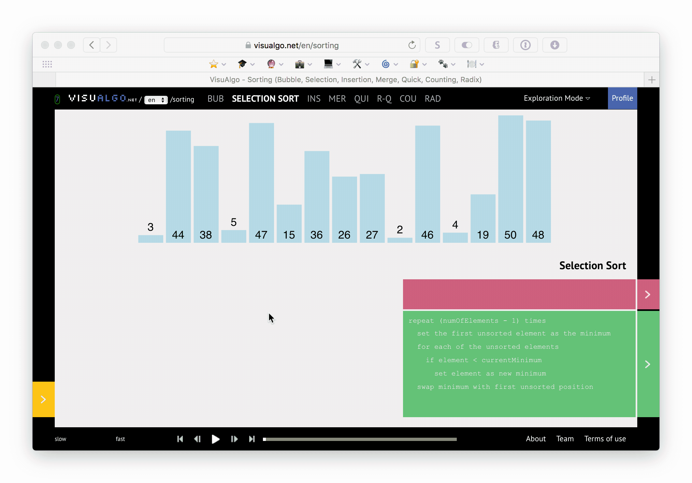

# Introduction to Algorithms

⭐️ **[@droxey](https://github.com/droxey)'s favorite algorithm? _[Conway's Game of Life](http://web.stanford.edu/~cdebs/GameOfLife/)!_** ⭐ ️


## Formal Definition

* Set of **steps** that **solve a problem/perform a calculation**.
* Algorithms seek to find **new ways to solve the same problems**:
  - More efficiently.
  - Better handling of scale.

## Linear Search [Best: _O(1)_ Worst: _O(n)_]

A search algorithm that grows proportionate to the size of the array to be searched.

### Pseudocode the Steps

1. Iterate over the array (`listOfInts`).
1. Check to see if the current number in the loop (`currentInt`) is equal to (`===`) the number we intended to find (`intToFind`).

### Implementation

```javascript
function linearSearch(listOfInts, intToFind) {
    listOfInts.forEach(function(currentInt, index) {
        if (currentInt === intToFind) {
            console.log("Found value:", currentInt, "at index:", index);
        }
    });
}

// Test the function.
const listOfInts = [3, 44, 38, 5, 47, 15, 36, 26, 27, 2, 46, 4, 19, 50, 48];
const intToFind = listOfInts[Math.floor(Math.random() * listOfInts.length)];
linearSearch(listOfInts, intToFind);
```

---

## Binary Search [Best: _O(1)_ Worst: _O(log n)_]

**Requires a pre-sorted array.** In each round, we check if the number we're trying is less than or more than the number we are looking for. This strategy allows programmers to effectively "halve" the number of options required in order to locate the target number.

[](https://visualgo.net/en/bst)

### Pseudocode the Steps

1. **Sort the array** (`listOfInts`).
1. **Find** the **number in middle** of the array.
1. Determine if the **middle number** is **less than / more than** the **number** we're attempting to find.
1. **Discard** the **half of the array** that **does not contain the number** we're searching for.
1. **Repeat steps 2 through 4** until the target number is located.

### Implementation

```javascript
var binarySearch = function (array, value) {
    if (array.length === 0) return -1;

    var guess,
        min = 0,
        max = array.length - 1;

    while (min <= max) {
        guess = Math.floor((min + max) / 2);
        if (array[guess] === value)
            return guess;
        else if (array[guess] < value)
            min = guess + 1;
        else
            max = guess - 1;
    }

    return -1;
}

// Test the function.
const listOfInts = [3,44,38,5,47,15,36,26,27,2,46,4,19,50,48];
const intToFind = listOfInts[Math.floor(Math.random() * listOfInts.length)];
const foundIntAtThisIndex = binarySearch(listOfInts, intToFind);
console.log("Found value:", listOfInts[foundIntAtThisIndex])
}
```

---

## Selection Sort [Best: _O(n<sup>2</sup>)_ Worst: _O(n<sup>2</sup>)_]

[](https://visualgo.net/en/sorting)

### Pseudocode the Steps

1. **Iterate** over the array (`listOfInts`).
1. Set the first **unsorted number** as the **minimum**.
1. If the **current number** is **LESS THAN** the **current minimum** (as set in step 2), then **set the current number as the new minimum**.
1. **Swap the minimum** with the **first unsorted position** in the array.


### Implementation

```javascript
function selectionSort(listOfInts) {
    const len = listOfInts.length;
    let min;

    for (var i = 0; i < len; i++) {
        min = i;    // Set index of minimum to this position

        // Check the rest of the array to see if anything is smaller.
        for (var j = i + 1; j < len; j++) {
            if (listOfInts[j] < listOfInts[min]) {
                min = j;
            }
        }

        if (i !== min) {
            // If the current position isn't the minimum,
            // swap it and the minimum.
            let temp = listOfInts[i];
            listOfInts[i] = listOfInts[min];
            listOfInts[min] = temp;
        }
    }
    return listOfInts;
}

// Test the function.
const listOfInts = [3,44,38,5,47,15,36,26,27,2,46,4,19,50,48];
const intToFind = listOfInts[Math.floor(Math.random() * listOfInts.length)];
const sortedArray = selectionSort(listOfInts);
console.log(sortedArray);
```

---

## Insertion Sort [Best: _O(n)_ Worst: _O(n<sup>2</sup>)_]

[](https://visualgo.net/en/sorting)

### Pseudocode the Steps

1. **Iterate** over the array (`listOfInts`).
1. **Compare** the number to the **right**, and the number to the **left**, of the target number (`intToFind`).
1. **Swap** if the **left is greater than the right**.
1. **Repeat** steps **2 and 3** until:
    1. The **current number** is **less than** the **number to it's right**.
    1. OR the **current number** is **in** the **last position within the array**.

### Implementation

```javascript
function insertionSort(listOfInts) {
    for (var i = 0; i < listOfInts.length; i++) {
        let value = listOfInts[i];

        // Store the current item value so it can be placed right.
        for (var j = i - 1; j > -1 && listOfInts[j] > value; j--) {
            // Loop through the items in the sorted array (the items from the current to the beginning) and copy each item to the next one.
            listOfInts[j + 1] = listOfInts[j];
        }

        // The last item we've reached should now hold the value of the currently sorted item.
        listOfInts[j + 1] = value;
    }

    return listOfInts;
}

// Test the function.
const listOfInts = [3, 44, 38, 5, 47, 15, 36, 26, 27, 2, 46, 4, 19, 50, 48];
console.log(insertionSort(listOfInts));
```

---

## Quicksort [Best: _O(n log n)_ Worst: _O(n<sup>2</sup>)_]

[](https://visualgo.net/en/sorting)

### Pseudocode the Steps

1. **Select a pivot number** from the array.
1. Create an array of **values less than the pivot**.
1. Create an array of **values greater than the pivot**.
1. **Recursively sort** left and right arrays, and **insert the pivot into it's final position**.

### Implementation

```javascript
function quickSort(array) {
  if (array.length <= 1) {
    return array;
  }

  // Get random pivot element (and remove from array to add back in later)
  const pivot = array.splice(Math.floor(Math.random() * array.length), 1);

  const left = [];      // Create left array (elements LESS THAN OR EQUAL TO pivot)
  const right = [];     // and right array (elements GREATER THAN the pivot)

  // loop through array and create left/right
  array.forEach(function(el) {
    if (el <= pivot) {
      left.push(el);
    }
    else {
      right.push(el);
    }
  });

  // Get the result of recursively sorting the left array (using quicksort), then join that with the // pivot and the result of recursively sorting the right array (using quicksort).
  // Equivalent of `return quicksort(left) + pivot + quicksort (right);` in the pseudocode
  return quickSort(left).concat(pivot, quickSort(right));
}

const listOfInts = [3, 44, 38, 5, 47, 15, 36, 26, 27, 2, 46, 4, 19, 50, 48];
console.log(quickSort(listOfInts));
```

---

## Additional Practice

* [Visualgo - Interactive Quiz: Sorting Algortithms](https://visualgo.net/training?diff=Medium&n=7&tl=0&module=sorting)
* [InterviewBit](https://www.interviewbit.com/)
* [LeetCode](https://leetcode.com/problemset/)
* [HackerRank: Practice Coding, Find Jobs](https://www.hackerrank.com)
* [Project Euler: Code + Mathematics](https://projecteuler.com)
* [InterviewCake: Practice Interview Questions](https://www.interviewcake.com)
